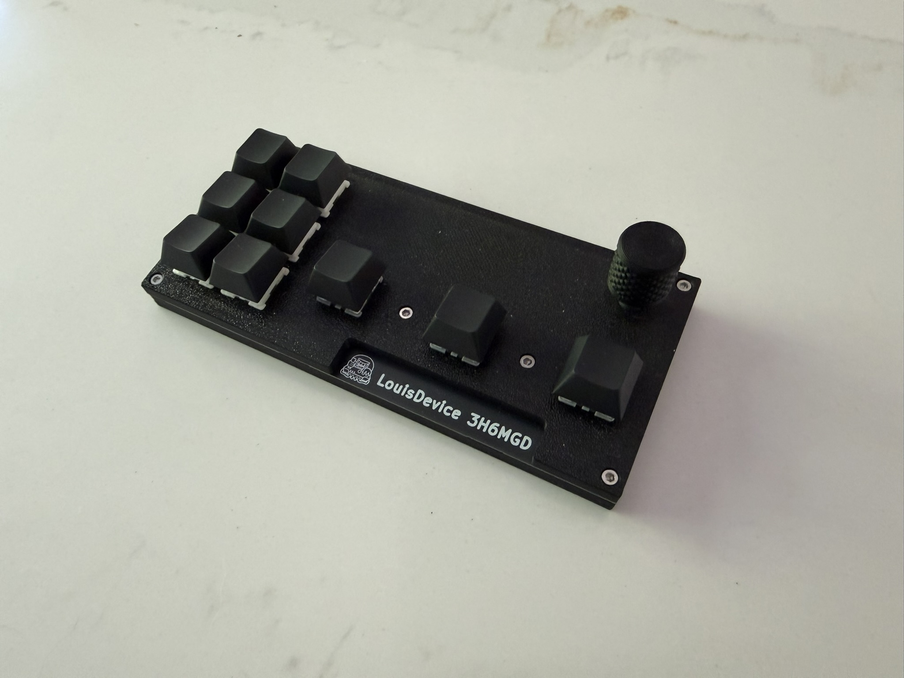

# 3H6MGD

A custom analog macropad for **Geometry Dash**, built around magnetic Hall-effect
switches for continuous key-travel sensing. The macroapd has three analog jump keys 
alongside six mechanical keys and a rotary encoder for volume control.

<p align="center">
  
</p>

---

## Why analog switches

Most keyboards report a key as simply pressed or not pressed. Hall-effect
switches instead measure how far the key has travelled, by reading the field of
a magnet in the switch stem with a linear sensor on the PCB. That continuous
position enables features that matter in a timing-based game like Geometry Dash —
primarily **adjustable actuation** (choose exactly how far down counts as a press). 
This board brings that to a compact macropad.

## Features

- **3 analog Hall-effect jump keys** programmable with hmkconf
- **6 mechanical keys** in a diode matrix for non-jump inputs
- **Rotary encoder** mapped to per-application volume and mute for Geometry Dash
- **8 kHz USB polling** via the AT32F405's high-speed USB
- Runs [libhmk](https://github.com/peppapighs/libhmk): analog behaviour is
  configured live in the browser through [hmkconf](https://hmkconf.com/)
- USB-C, flashed over WebUSB DFU

## Hardware

- **MCU:** Artery AT32F405RCT7
- **Analog switches:** Wooting Lekker Tikken Medium, with MT9102ET linear Hall
  sensors (SOT-23-3) on the PCB
- **Mechanical switches:** MX switches on GATERON Upgrade Hot-swap PCB 2.0 Socket-KS-2P02B01-01-a
- **Rotary encoder:** Alps EC11E15244G1 30 detent with push switch
- **PCB:** 2-layer, 1.2 mm, designed in KiCad, manufactured by JLCPCB
- **Case:** two-piece sandwich, printed in PETG or PLA, with a printed knob

<p align="center">
  
  
</p>

## Firmware

The board runs [libhmk](https://github.com/peppapighs/libhmk). Everything about
the firmware (how the board is defined, the custom module that adds the
mechanical matrix and encoder, how to build and flash it, and the calibration and
volume-control setup) is in **[firmware/README.md](firmware/README.md)**.

## Repository layout

```
firmware/   libhmk keyboard definition, custom matrix + encoder module, build docs
kicad/      KiCad project (schematic and PCB)_
cad/        Case and knob models
images/     Renders and photos
docs/       Design notes and references
```

## Acknowledgements

This project builds on the open-source Hall-effect keyboard community:

- **[libhmk](https://github.com/peppapighs/libhmk)** and
  **[HE60](https://github.com/peppapighs/HE60)** by
  [peppapighs](https://github.com/peppapighs) - the firmware this board runs and
  the reference hardware it draws from
- **[marbastlib](https://github.com/ebastler/marbastlib)** by
  [ebastler](https://github.com/ebastler) - KiCad footprints for the Hall-effect
  and mechanical switches
- [Encoder Knob](https://www.thingiverse.com/thing:4206617) by V0lD, from Thingiverse, licensed CC BY-NC

## License

The firmware (`firmware/`) is licensed under **GNU General Public License v3.0**, inherited from
[libhmk](https://github.com/peppapighs/libhmk), on which it is based. The hardware
(`kicad/`) and case (`cad/`) files are licensed under **MIT License**. The encoder
knob is a third-party design under CC BY-NC 4.0 — see Acknowledgements.